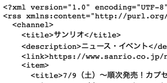

# Sanrio News

An rss feed to read official sanrio news and host on Google App Script



## Usage

### npm

```
git clone git@github.com:markkong318/sanrio-news.git
cd sanrio-news
npm install
```

### Clasp

**.clasp.json**

add your scriptId to .clasp.json by clasp command

```
clasp create
```

**appscript.json**

change appscript.json you want

- Time Zone（default: "Asia/Tokyo"）
- OAuth

### deploy

```
npm run deploy
```

### app script console

create a new deploy and get the url
